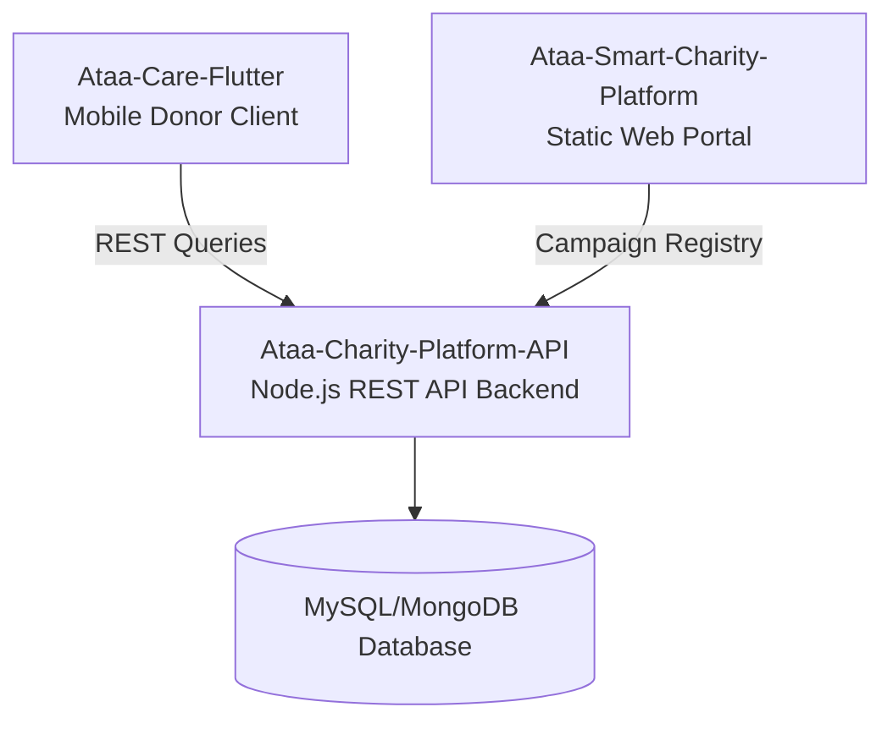

# 💚 أهلاً بكم في فريق عطاء الذكي | Welcome to Ataa Smart Charity Ecosystem

  

فريق **عطاء** يعمل على بناء وإتاحة حلول برمجية متكاملة ومفتوحة المصدر لدعم وإدارة المؤسسات الخيرية وحملات التبرع، وتسهيل تتبع التدفقات المالية وتقارير المستفيدين إلكترونياً.

**Ataa Smart Charity Ecosystem** provides comprehensive open-source digital solutions to support and scale charitable organizations, campaign funding operations, donor engagements, and transparent audit telemetry.

---

## 🧬 بنية النظام وتكامل الخدمات | Ecosystem Architecture

تتصل الواجهات المتعددة بالخادم الخلفي لتسهيل وتنظيم عمليات التبرع:

---

## 📂 مستودعات النظام (Our Repositories)

| المستودع (Repository) | النوع | الوصف (Description) | الشارات التقنية (Tech Badges) |
| :--- | :--- | :--- | :--- |
| 📱 **[Ataa-Care-Flutter](https://github.com/Ataa-Charity-Viewer-Team/Ataa-Care-Flutter)** | Mobile | تطبيق الهاتف الذكي الموجه للمتبرعين لمتابعة واستكشاف الحملات الخيرية الفعالة والتبرع الفوري. |   |
| ⚙️ **[Ataa-Charity-Platform-API](https://github.com/Ataa-Charity-Viewer-Team/Ataa-Charity-Platform-API)** | Backend | خادم البرمجة الخلفي لإدارة الحملات وتوثيق المتبرعين والجمعيات الشريكة والتحقق من المعاملات. |   |

---
